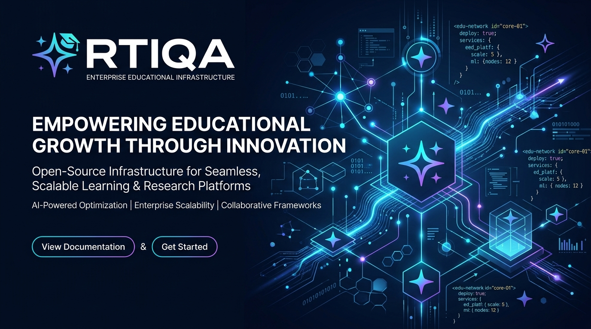
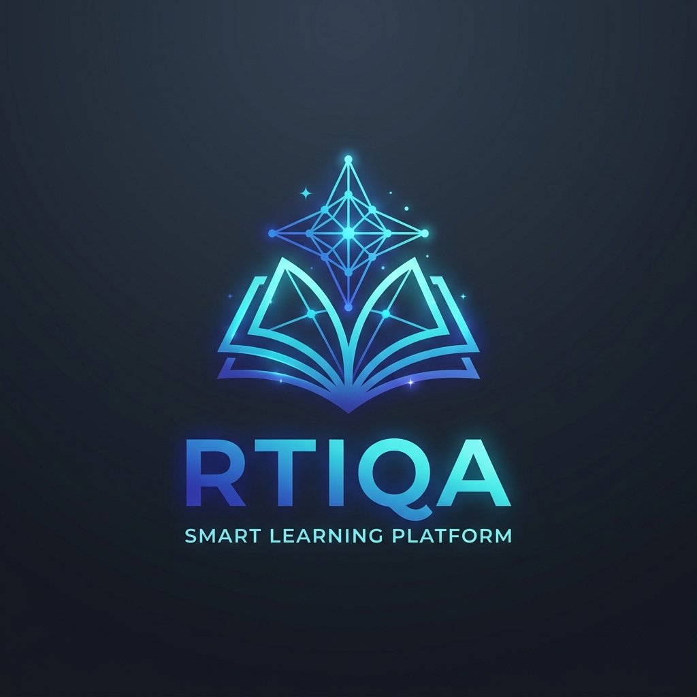

<div align="center">

  

  <br /><br />

  

  # 🎓 RTIQA (رتقاء) — Smart Learning Platform

  **Enterprise-Grade, Offline-First Educational Ecosystem & Multi-Tenant Infrastructure**

  [](https://github.com/rtiqa/mobile/actions/workflows/ci.yml)
  [](LICENSE)
  [](https://kotlinlang.org)
  [](https://developer.android.com)
  [](https://developer.android.com/jetpack/compose)
  [](docs/ARCHITECTURE.md)
  [](docker/docker-compose.yml)
  [](helm/rtiqa-stack/)

</div>

---

## 📖 Overview

**RTIQA (رتقاء)** is an open-source, enterprise-grade educational platform engineered for high-scale, offline-first mobile learning. Built natively in **Kotlin** and **Jetpack Compose (Material 3)**, RTIQA pairs an intelligent **Gemini 1.5 AI Tutor** with local **Room SQLite persistence**, instant vector search, and containerized cloud microservices.

Designed from the ground up for **bilingual (Arabic & English)** accessibility, RTIQA features dynamic Right-to-Left (RTL) layout mirroring, offline lesson downloads, gamified quizzes, verified digital certificates, and a complete institutional microservice backend.

---

## 🌟 Key Platform Capabilities

- 🧠 **AI Tutor (المعلم الذكي)**: Context-aware interactive assistant powered by Gemini 1.5, offering real-time explanations, hint generation, and instant local offline fallback.
- 📚 **Offline-First Course & Lesson Engine**: Zero-latency offline learning powered by Room DB with automatic `WorkManager` background synchronization.
- 📝 **Interactive Quizzes & Assessments**: Adaptive multiple-choice and true/false assessments with instant grading, explanations, and XP rewards.
- 🏆 **Gamification & Digital Certificates**: Streak counters, achievement badges, XP economy, and downloadable PDF/image completion certificates.
- 🏫 **School Administration Portal**: Admin dashboard for managing classrooms, student progress telemetry, course publishing, and system analytics.
- 🌐 **Bilingual (Arabic/English) RTL Support**: Native Right-to-Left (RTL) UI mirroring, localized typography, and seamless language switching.
- ⚡ **Production Microservices Stack**: Containerized infrastructure including Keycloak (IAM/OIDC), Supabase PostgreSQL 15 + pgvector, Directus CMS, LiveKit SFU, Typesense Search, Qdrant Vector DB, and OpenTelemetry.

---

## 🏛️ System Architecture

RTIQA is structured as a **Multi-Module Clean Architecture** project to maximize code reusability, testability, and build performance:

```
                           +-------------------+
                           |      :app         |
                           | (App Container &  |
                           |   Navigation)     |
                           +---------+---------+
                                     |
             +-----------------------+-----------------------+
             |                       |                       |
     +-------v-------+       +-------v-------+       +-------v-------+
     | feature-home  |       | feature-courses|       |  feature-ai   |
     | feature-quiz  |       | feature-admin |       | feature-auth  |
     +-------+-------+       +-------+-------+       +-------+-------+
             |                       |                       |
             +-----------------------+-----------------------+
                                     |
                  +------------------v-------------------+
                  |            core-data                 |
                  |   (Repositories, Mappers, Sync)      |
                  +--------+--------------------+--------+
                           |                    |
               +-----------v----+          +----v-----------+
               | core-database  |          |  core-network  |
               |  (Room DB &    |          | (Retrofit/Ktor |
               |   Entities)    |          |  Gemini API)   |
               +----------------+          +----------------+
```

For complete architectural details, read [`docs/ARCHITECTURE.md`](docs/ARCHITECTURE.md).

---

## 📂 Directory Structure

```
.
├── .github/                # Issue templates, PR templates, CODEOWNERS & Actions workflows
├── app/                    # Main Android application container & Navigation graph
├── assets/                 # Repository branding assets (logo, banner)
├── core-ai/                # AI Tutor abstractions & Gemini API interfaces
├── core-data/              # Data repositories, mappers & background sync manager
├── core-database/          # Room DB entities, DAOs & migration handlers
├── core-design/            # RDS design tokens & core styling
├── core-domain/            # Domain models, result wrappers & interfaces
├── core-network/           # Retrofit & OkHttp client configurations
├── core-ui/                # Shared Jetpack Compose component library
├── deploy/                 # Ktor 2.3 backend microservice gateway
├── docker/                 # Production Docker Compose stack (Keycloak, LiveKit, Qdrant, etc.)
├── docs/                   # Platform architecture, API specs, and dev guides
├── feature-*/              # Isolated Compose UI feature modules
├── helm/                   # Kubernetes Helm deployment chart (rtiqa-stack)
├── scripts/                # Zero-to-production bootstrap & automation scripts
└── .env.example            # Environment variable configuration template
```

---

## 🛠️ Tech Stack & Open Source Libraries

### Android Native App
- **Language**: [Kotlin 2.0](https://kotlinlang.org/) (100%)
- **UI Framework**: [Jetpack Compose](https://developer.android.com/jetpack/compose) (Material Design 3)
- **Database**: [Room 2.6](https://developer.android.com/training/data-storage/room) with KSP annotation processing
- **Networking**: [Retrofit 2](https://square.github.io/retrofit/) & OkHttp 3
- **AI Integration**: [Google Gemini 1.5 REST API](https://ai.google.dev/)
- **Asynchrony**: Kotlin Coroutines & `StateFlow`
- **Background Jobs**: AndroidX `WorkManager`
- **Testing**: JUnit 4, Robolectric, Kotlinx Coroutines Test

### Cloud Infrastructure & Microservices
- **Gateway**: [Ktor 2.3](https://ktor.io/) Kotlin Backend Engine
- **Identity & IAM**: [Keycloak 24](https://www.keycloak.org/) (OIDC / PKCE)
- **Primary Database**: PostgreSQL 15 + `pgvector` extension
- **Content Engine**: [Directus Headless CMS](https://directus.io/)
- **Live Media**: [LiveKit WebRTC SFU](https://livekit.io/)
- **Search Engine**: [Typesense 26](https://typesense.org/) In-Memory Search
- **Vector DB**: [Qdrant Rust](https://qdrant.tech/) Vector Engine
- **Observability**: [OpenTelemetry Collector](https://opentelemetry.io/)

---

## 🚀 Zero-to-Production Quickstart

### Prerequisites
- JDK 17 (Temurin recommended)
- Android Studio Ladybug (2024.2.1+) or IntelliJ IDEA
- Docker & Docker Compose (optional, for backend stack)

### 1. Bootstrap Local Environment
Run the unified bootstrap script to initialize environment configurations:
```bash
chmod +x scripts/bootstrap.sh
./scripts/bootstrap.sh
```

### 2. Build & Test Android App
```bash
# Run unit tests
gradle testDebugUnitTest

# Build debug APK
gradle assembleDebug
```

### 3. Launch Docker Microservice Stack (Optional)
```bash
cd docker
docker compose up -d
```
All microservices will initialize:
- **Keycloak IAM**: `http://localhost:8080`
- **Directus CMS**: `http://localhost:8055`
- **LiveKit WebRTC**: `http://localhost:7880`
- **Typesense Search**: `http://localhost:8108`
- **Qdrant Vector DB**: `http://localhost:6333`
- **Ktor Backend Gateway**: `http://localhost:8081/health`

---

## 📚 Documentation Index

| Guide | Description |
| :--- | :--- |
| [ Architecture Guide](docs/ARCHITECTURE.md) | In-depth breakdown of multi-module MVVM, UDF, and data flow |
| [ API Specifications](docs/API.md) | REST, OIDC, WebRTC, and vector search API endpoints |
| [ Development Guide](docs/DEVELOPMENT.md) | Local environment setup, testing patterns, and code conventions |
| [ Release Process](docs/RELEASE_PROCESS.md) | Semantic versioning, build artifacts, and release pipeline |
| [ Security Policy](SECURITY.md) | Vulnerability reporting procedure and security standards |
| [ 🗺️ Product Roadmap](ROADMAP.md) | 2026 feature milestones and engineering goals |
| [ 📜 Changelog](CHANGELOG.md) | Complete version history and release notes |

---

## 🤝 Community & Contributing

We welcome contributions from developers worldwide! Please review our [Contributing Guidelines](CONTRIBUTING.md) and [Code of Conduct](CODE_OF_CONDUCT.md) before submitting pull requests.

---

## 📄 License

RTIQA is released under the [Apache License 2.0](LICENSE).

```text
Copyright 2026 RTIQA Platform Maintainers

Licensed under the Apache License, Version 2.0 (the "License");
you may not use this file except in compliance with the License.
You may obtain a copy of the License at

    http://www.apache.org/licenses/LICENSE-2.0
```
